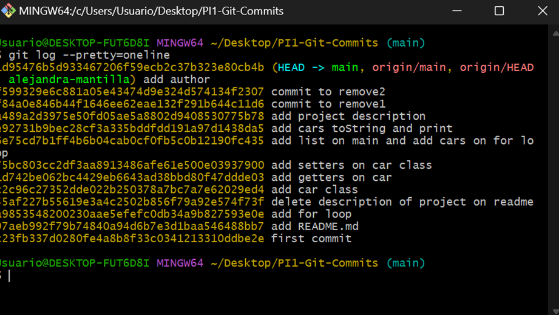
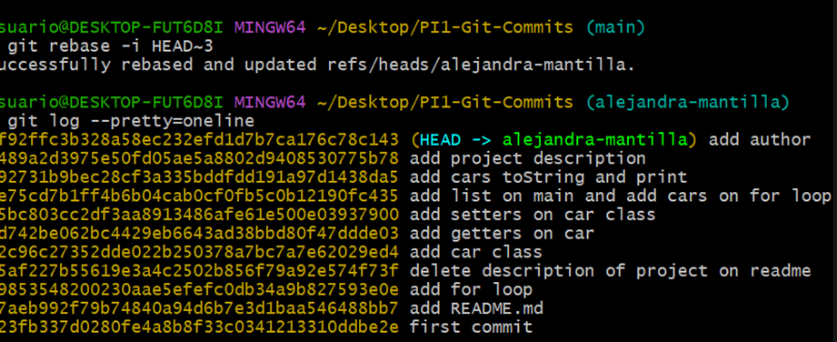
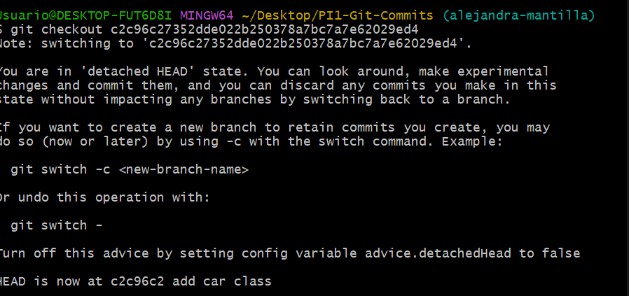
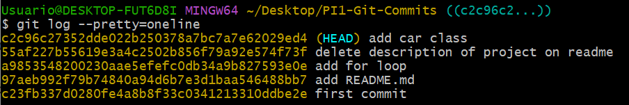
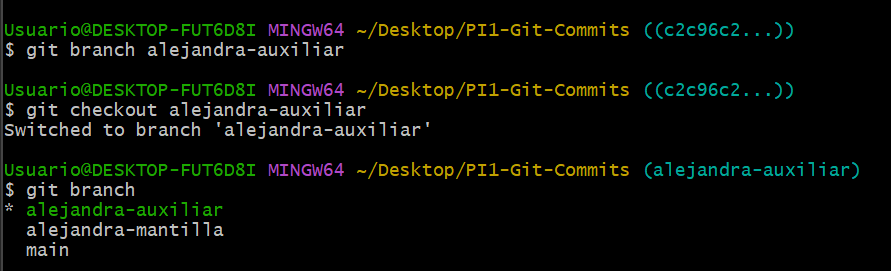
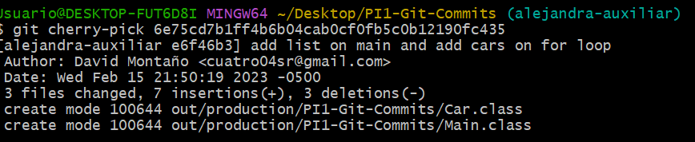
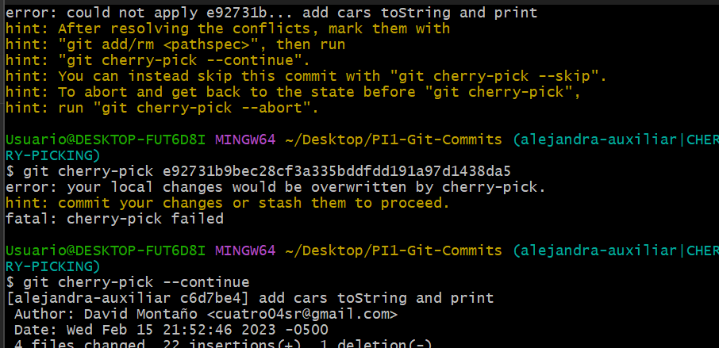
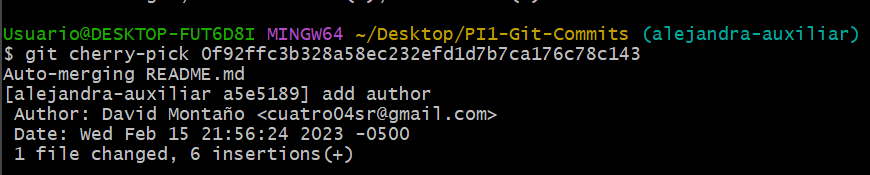
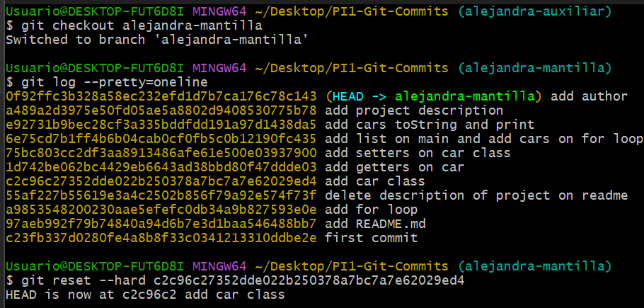
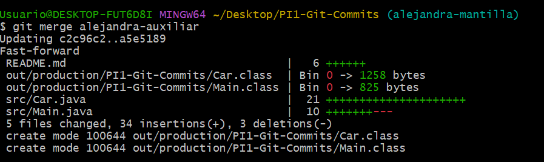

**Git rebase**

1. Eliminación de los commits “commit to remove2” y “commit to 
remove1”.

**Git cherry-pick y reset**

1.  Encontrar el commit “add car class” y moverse usando git checkout al hash del commit.

2. Desde ese commit crean una nueva rama auxiliar (llámenla como quieran) y se cambian a ella.

3. Deberán borrar todos los commits excepto “add list on main and add cars on for loop”, “add  cars toString and print” y “add author”. Osea, deberan usar el commando git cherry pick con  los hash de estos commits.

4. Se deben mover a la rama de su nombre y devolverse al commit “add car class” usando git  reset --hard.

5. Realizan un merge con la branch auxiliar que crearon.
