# Informe

## Andrés Parra

### Rebase:

Primer momento, log de commits:

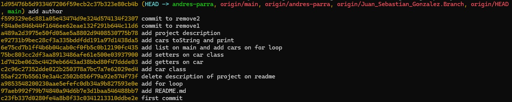

Luego de ejecutar el rebase:

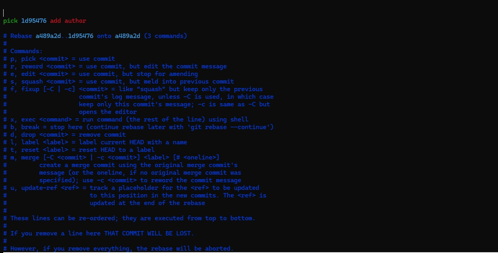

Después de removerlos:

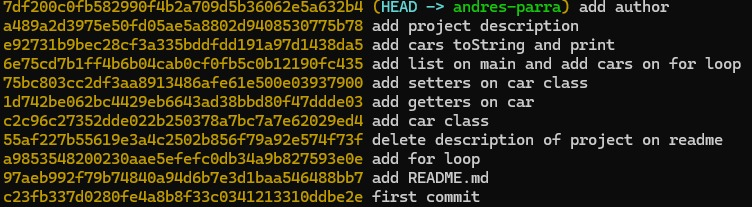

### Cherry-pick y reset:

Buscamos el commit "add car class"

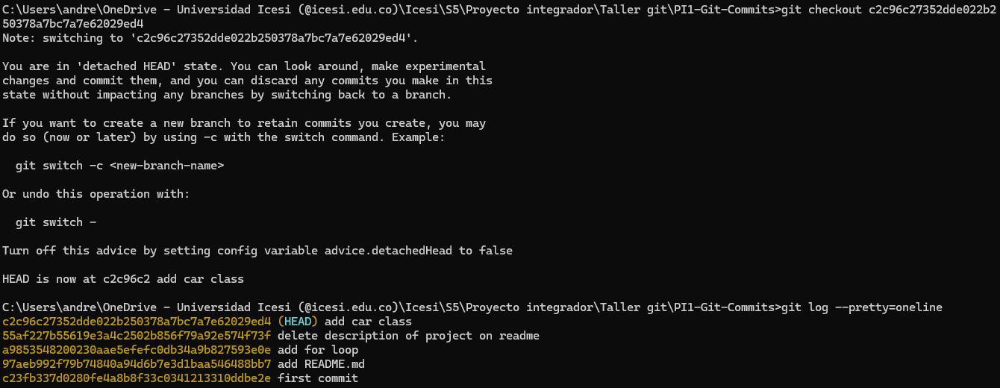

Creando una rama auxiliar y cambiando a ella:

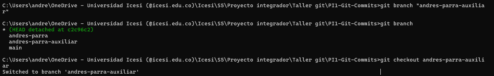

cherry-pick para "add list on main and add cars on for loop"

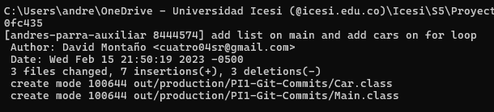

cherry-pick para "add cars toString and print" -> Da conflicto y se soluciona en visual studio.

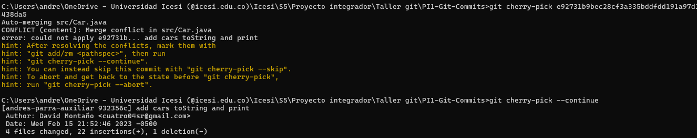

cherry-pick para "add author"

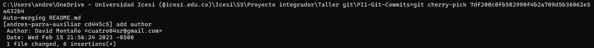

Movernos a la primer rama y hacer un reset a "add car class"

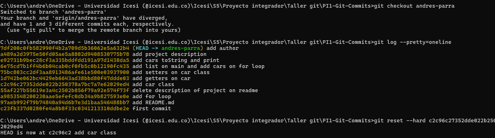

Merge de la rama auxiliar

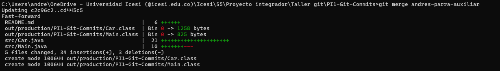

Un push forzado

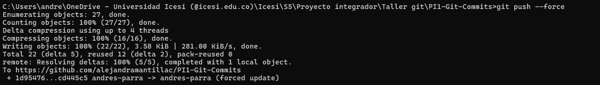
